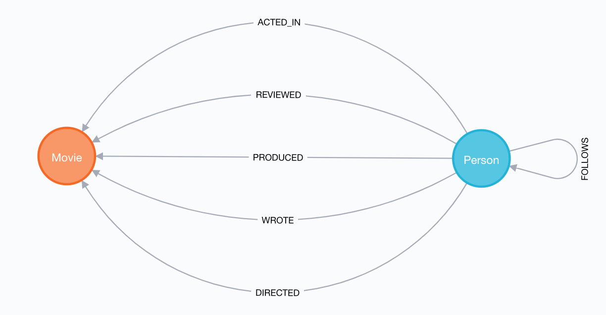
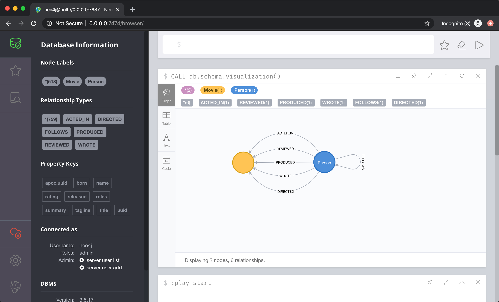
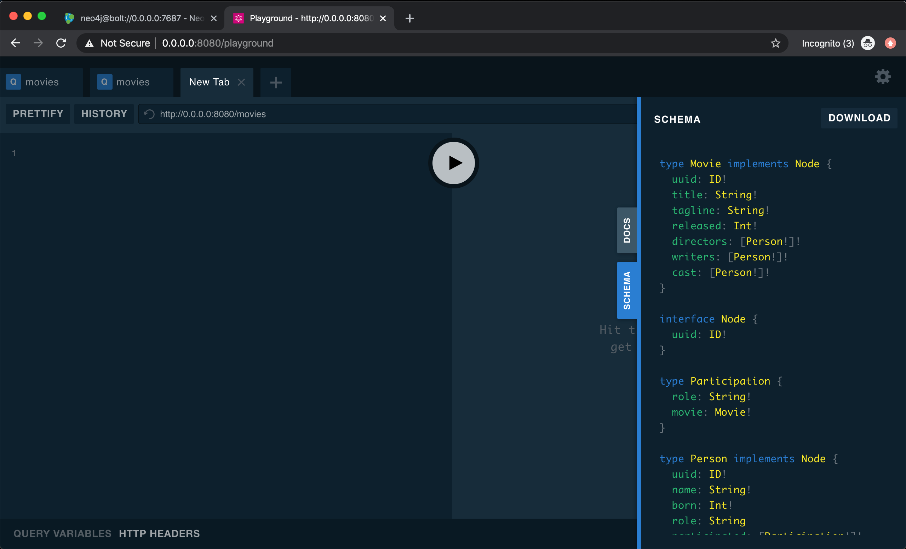
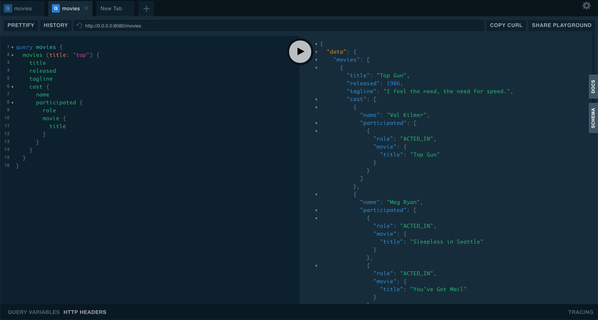

# goneo4jgql

Golang + Neo4j + GraphQL + Docker stack example


## Stack

* [Go 1.14](https://golang.org/doc/go1.14)
* [gqlgen](https://github.com/99designs/gqlgen)
* [neo4j-go-driver](github.com/neo4j/neo4j-go-driver)
* [Neo4j apoc plugin](https://github.com/neo4j-contrib/neo4j-apoc-procedures/releases/download/3.5.0.9/apoc-3.5.0.9-all.jar)
* [seabolt connector v1.7.4](https://github.com/neo4j-drivers/seabolt)
* [Neo4j Server v3.5.17](https://github.com/neo4j/neo4j/wiki/Neo4j-3.5-changelog#3517)
* [Docker](https://www.docker.com/)


## Introduction

This is just a simple example on how to implement a GrapqhQL API on top of Neo4j using Golang. I have included the [Neo4j movie example dataset](https://neo4j.com/developer/guide-cypher-basics/) that has the followin domain model:



**Note**: I have slightly modified the original dataset by adding UUIDs to each node. You can find the cyper queries I used for that at the end of the [movies.cyper import file](neo4j/import/movies.cypher)


## Setup (Using Docker)

You just need to install [Docker](https://docs.docker.com/get-docker/) and [Docker compose](https://docs.docker.com/compose/) (included with the latest version of Docker).

1 - Clone this repo
```bash
git clone https://github.com/charlysan/pyrfidhid.git
```

2 - Build app docker image
```bash
docker-compose -f dockercompose.yml build
```

3 - Startup Neo4j and goneo4jgql containers:
```bash
docker-compose -f dockercompose.yml up -d
```

Check the logs
```bash
docker-compose -f dockercompose.yml up -d
```

You should get an output like this one:
```
$ docker-compose -f dockercompose.yml logs -f
Attaching to goneo4jgql, neo4j
goneo4jgql | time="2020-04-16T05:54:09Z" level=info msg="Connected to Neo4j Server" neo4j_server_uri="bolt://neo4j:7687" prefix=main
goneo4jgql | time="2020-04-16T05:54:09Z" level=info msg="API Listening" api_url="0.0.0.0:8080" prefix=main
neo4j    | Fetching versions.json for Plugin 'apoc' from https://neo4j-contrib.github.io/neo4j-apoc-procedures/versions.json
neo4j    | Installing Plugin 'apoc' from https://github.com/neo4j-contrib/neo4j-apoc-procedures/releases/download/3.5.0.9/apoc-3.5.0.9-all.jar to /plugins/apoc.jar
neo4j    | Applying default values for plugin apoc to neo4j.conf
neo4j    | Skipping dbms.security.procedures.unrestricted for plugin apoc because it is already set
neo4j    | Active database: graph.db
neo4j    | Directories in use:
neo4j    |   home:         /var/lib/neo4j
neo4j    |   config:       /var/lib/neo4j/conf
neo4j    |   logs:         /logs
neo4j    |   plugins:      /plugins
neo4j    |   import:       /var/lib/neo4j/import
neo4j    |   data:         /var/lib/neo4j/data
neo4j    |   certificates: /var/lib/neo4j/certificates
neo4j    |   run:          /var/lib/neo4j/run
neo4j    | Starting Neo4j.
neo4j    | 2020-04-16 05:54:27.396+0000 INFO  ======== Neo4j 3.5.17 ========
neo4j    | 2020-04-16 05:54:27.470+0000 INFO  Starting...
neo4j    | 2020-04-16 05:54:59.164+0000 INFO  Bolt enabled on 0.0.0.0:7687.
neo4j    | 2020-04-16 05:55:05.645+0000 INFO  Started.
neo4j    | 2020-04-16 05:55:09.186+0000 INFO  Remote interface available at http://localhost:7474/
```

4 - Load movie dataset
```bash
docker-compose -f dockercompose.yml exec neo4j /bin/bash -c 'cat /var/lib/neo4j/import/movies.cypher | cypher-shell -u neo4j -p test'
```

That's all. You should be able to login to Neo4j browser at [http://127.0.0.1:7474/browser/](http://127.0.0.1:7474/browser/)

Use the default **credentials** set in [dockercompose.yml file](./dockercompose.yml)
```
user: neo4j
pass: test
```




## GraphQL API Usage

You should be able to access Playground at [http://0.0.0.0:8080/playground](http://0.0.0.0:8080/playground) and see something like this:




### QraphQL queries examples

**Get the list of movies** 

```graphql
query movies {
  movies {
    title
    released
    tagline
  }
}
```

**Get the list of movies that contains "top" in their title** 
```graphql
query movies {
  movies (title: "top") {
    title
    released
    tagline
  }
}
```

**Get cast, directors and writer data**
```graphql
query movies {
  movies (title: "top") {
    title
    released
    tagline
    cast {
      name
    }
    directors {
      name
    }
    writers {
      name
    }
  }
}
```


**Get the list of participations for each cast member for Top Gun**
```graphql
query movies {
  movies (title: "top") {
    title
    released
    tagline
    cast {
      name
      participated {
        role
        movie {
          title
        }
      }
    }
  }
}
```


